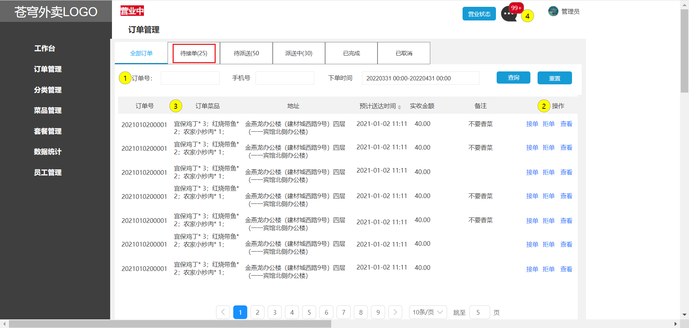
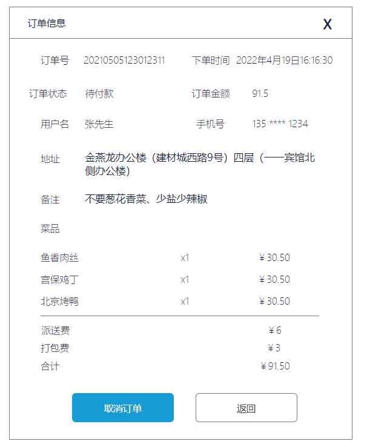
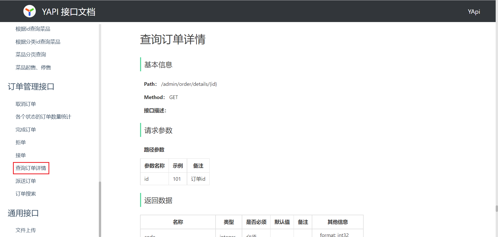
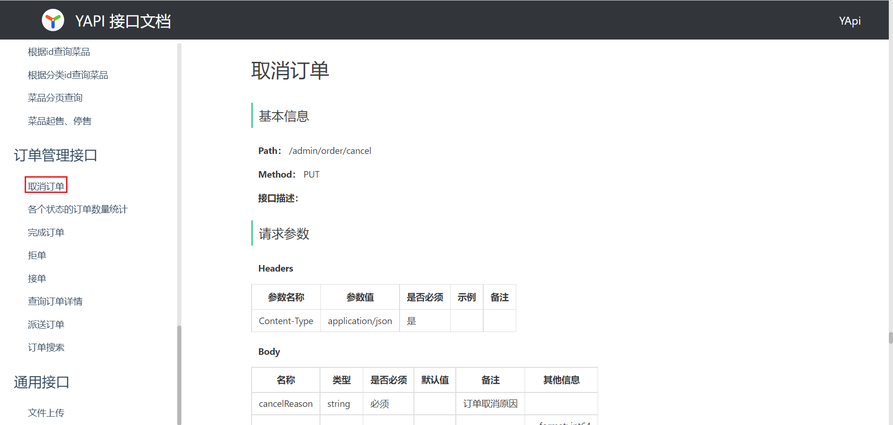

## 1. 订单搜索

### 1.1 需求分析和设计

产品原型：

业务规则：

- 输入订单号/手机号进行搜索，支持模糊搜索
- 根据订单状态进行筛选
- 下单时间进行时间筛选
- 搜索内容为空，提示未找到相关订单
- 搜索结果页，展示包含搜索关键词的内容
- 分页展示搜索到的订单数据

接口设计：

![[Pasted image 20240529163034.png|272]]
 
  返回数据：

| 名称                       | 类型          | 是否必须 | 默认值 | 备注               | 其他信息            |
| ------------------------ | ----------- | ---- | --- | ---------------- | --------------- |
| code                     | number      | 必须   |     |                  |                 |
| msg                      | null        | 非必须  |     |                  |                 |
| data                     | object      | 非必须  |     |                  |                 |
| ├─ total                 | number      | 非必须  |     |                  |                 |
| ├─ records               | object []   | 非必须  |     |                  | item 类型: object |
| ├─ id                    | number      | 必须   |     |                  |                 |
| ├─ number                | string      | 必须   |     |                  |                 |
| ├─ status                | number      | 必须   |     |                  |                 |
| ├─ userId                | number      | 必须   |     |                  |                 |
| ├─ addressBookId         | number      | 必须   |     |                  |                 |
| ├─ orderTime             | string      | 必须   |     |                  |                 |
| ├─ checkoutTime          | null,string | 必须   |     |                  |                 |
| ├─ payMethod             | number      | 必须   |     |                  |                 |
| ├─ payStatus             | number      | 必须   |     |                  |                 |
| ├─ amount                | number      | 必须   |     |                  |                 |
| ├─ remark                | string      | 必须   |     |                  |                 |
| ├─ userName              | string      | 必须   |     |                  |                 |
| ├─ phone                 | string      | 必须   |     |                  |                 |
| ├─ address               | string      | 必须   |     |                  |                 |
| ├─ consignee             | string      | 必须   |     |                  |                 |
| ├─ cancelReason          | string      | 必须   |     |                  |                 |
| ├─ rejectionReason       | string      | 必须   |     |                  |                 |
| ├─ cancelTime            | string      | 必须   |     |                  |                 |
| ├─ estimatedDeliveryTime | string      | 必须   |     |                  |                 |
| ├─ deliveryStatus        | number      | 必须   |     |                  |                 |
| ├─ deliveryTime          | string      | 必须   |     |                  |                 |
| ├─ packAmount            | number      | 必须   |     |                  |                 |
| ├─ tablewareNumber       | number      | 必须   |     |                  |                 |
| ├─ tablewareStatus       | number      | 必须   |     |                  |                 |
| ├─ orderDishes           | string      | 必须   |     | 订单包含的菜品，以字符串形式展示 |                 |

### 1.2 代码实现

#### 1.2.1 admin/OrderController

在admin包下创建OrderController

~~~java
/**
 * 订单管理
 */
@RestController("adminOrderController")
@RequestMapping("/admin/order")
@Slf4j
@Api(tags = "订单管理接口")
public class OrderController {

    @Autowired
    private OrderService orderService;

    /**
     * 订单搜索
     *
     * @param ordersPageQueryDTO
     * @return
     */
    @GetMapping("/conditionSearch")
    @ApiOperation("订单搜索")
    public Result<PageResult> conditionSearch(OrdersPageQueryDTO ordersPageQueryDTO) {
        PageResult pageResult = orderService.conditionSearch(ordersPageQueryDTO);
        return Result.success(pageResult);
    }
}
~~~

#### 1.2.2 OrderService

~~~java
    /**
     * 条件搜索订单
     * @param ordersPageQueryDTO
     * @return
     */
    PageResult conditionSearch(OrdersPageQueryDTO ordersPageQueryDTO);
~~~

#### 1.2.3 OrderServiceImpl

~~~java
    /**
     * 订单搜索
     *
     * @param ordersPageQueryDTO
     * @return
     */
    public PageResult conditionSearch(OrdersPageQueryDTO ordersPageQueryDTO) {
        PageHelper.startPage(ordersPageQueryDTO.getPage(), ordersPageQueryDTO.getPageSize());

        Page<Orders> page = orderMapper.pageQuery(ordersPageQueryDTO);

        // 部分订单状态，需要额外返回订单菜品信息，将Orders转化为OrderVO
        List<OrderVO> orderVOList = getOrderVOList(page);

        return new PageResult(page.getTotal(), orderVOList);
    }

    private List<OrderVO> getOrderVOList(Page<Orders> page) {
        // 需要返回订单菜品信息，自定义OrderVO响应结果
        List<OrderVO> orderVOList = new ArrayList<>();

        List<Orders> ordersList = page.getResult();
        if (!CollectionUtils.isEmpty(ordersList)) {
            for (Orders orders : ordersList) {
                // 将共同字段复制到OrderVO
                OrderVO orderVO = new OrderVO();
                BeanUtils.copyProperties(orders, orderVO);
                String orderDishes = getOrderDishesStr(orders);

                // 将订单菜品信息封装到orderVO中，并添加到orderVOList
                orderVO.setOrderDishes(orderDishes);
                orderVOList.add(orderVO);
            }
        }
        return orderVOList;
    }

    /**
     * 根据订单id获取菜品信息字符串
     *
     * @param orders
     * @return
     */
    private String getOrderDishesStr(Orders orders) {
        // 查询订单菜品详情信息（订单中的菜品和数量）
        List<OrderDetail> orderDetailList = orderDetailMapper.getByOrderId(orders.getId());

        // 将每一条订单菜品信息拼接为字符串（格式：宫保鸡丁*3；）
        List<String> orderDishList = orderDetailList.stream().map(x -> {
            String orderDish = x.getName() + "*" + x.getNumber() + ";";
            return orderDish;
        }).collect(Collectors.toList());

        // 将该订单对应的所有菜品信息拼接在一起
        return String.join("", orderDishList);
    }
~~~

### 1.3 功能测试

![[Pasted image 20240529195047.png]]

![[Pasted image 20240529195058.png]]

## 2. 各个状态的订单数量统计

### 2.1 需求分析和设计

接口设计：

![[Pasted image 20240529195256.png|400]]
### 2.2 代码实现

#### 2.2.1 admin/OrderController

~~~java
    /**
     * 各个状态的订单数量统计
     *
     * @return
     */
    @GetMapping("/statistics")
    @ApiOperation("各个状态的订单数量统计")
    public Result<OrderStatisticsVO> statistics() {
        OrderStatisticsVO orderStatisticsVO = orderService.statistics();
        return Result.success(orderStatisticsVO);
    }
~~~

#### 2.2.2 OrderService

~~~java
    /**
     * 各个状态的订单数量统计
     * @return
     */
    OrderStatisticsVO statistics();
~~~

#### 2.2.3 OrderServiceImpl

~~~java
    /**
     * 各个状态的订单数量统计
     *
     * @return
     */
    public OrderStatisticsVO statistics() {
        // 根据状态，分别查询出待接单、待派送、派送中的订单数量
        Integer toBeConfirmed = orderMapper.countStatus(Orders.TO_BE_CONFIRMED);
        Integer confirmed = orderMapper.countStatus(Orders.CONFIRMED);
        Integer deliveryInProgress = orderMapper.countStatus(Orders.DELIVERY_IN_PROGRESS);

        // 将查询出的数据封装到orderStatisticsVO中响应
        OrderStatisticsVO orderStatisticsVO = new OrderStatisticsVO();
        orderStatisticsVO.setToBeConfirmed(toBeConfirmed);
        orderStatisticsVO.setConfirmed(confirmed);
        orderStatisticsVO.setDeliveryInProgress(deliveryInProgress);
        return orderStatisticsVO;
    }
~~~

#### 2.2.4 OrderMapper

~~~java
    /**
     * 根据状态统计订单数量
     * @param status
     */
    @Select("select count(id) from orders where status = #{status}")
    Integer countStatus(Integer status);
~~~

### 2.3 功能测试

![[Pasted image 20240529202621.png]]

## 3. 查询订单详情

### 3.1 需求分析和设计

产品原型：

业务规则：

- 订单详情页面需要展示订单基本信息（状态、订单号、下单时间、收货人、电话、收货地址、金额等）
- 订单详情页面需要展示订单明细数据（商品名称、数量、单价）

接口设计：参见接口文档

### 3.2 代码实现

#### 3.2.1 admin/OrderController

~~~java
    /**
     * 订单详情
     *
     * @param id
     * @return
     */
    @GetMapping("/details/{id}")
    @ApiOperation("查询订单详情")
    public Result<OrderVO> details(@PathVariable("id") Long id) {
        OrderVO orderVO = orderService.details(id);
        return Result.success(orderVO);
    }
~~~

### 3.3 功能测试

![[Pasted image 20240529204124.png]]

## 4. 接单

### 4.1 需求分析和设计

产品原型：

业务规则：

- 商家接单其实就是将订单的状态修改为“已接单”

接口设计：参见接口文档

### 4.2 代码实现

#### 4.2.1 admin/OrderController

~~~java
    /**
     * 接单
     *
     * @return
     */
    @PutMapping("/confirm")
    @ApiOperation("接单")
    public Result confirm(@RequestBody OrdersConfirmDTO ordersConfirmDTO) {
        orderService.confirm(ordersConfirmDTO);
        return Result.success();
    }
~~~

#### 4.2.2 OrderService

~~~java
    /**
     * 接单
     *
     * @param ordersConfirmDTO
     */
    void confirm(OrdersConfirmDTO ordersConfirmDTO);
~~~

#### 4.2.3 OrderServiceImpl

~~~java
    /**
     * 接单
     *
     * @param ordersConfirmDTO
     */
    public void confirm(OrdersConfirmDTO ordersConfirmDTO) {
        Orders orders = Orders.builder()
                .id(ordersConfirmDTO.getId())
                .status(Orders.CONFIRMED)
                .build();

        orderMapper.update(orders);
    }
~~~

### 4.3 功能测试

![[Pasted image 20240529204415.png]]

## 5. 拒单

### 5.1 需求分析和设计

产品原型：

业务规则：

- 商家拒单其实就是将订单状态修改为“已取消”
- 只有订单处于“待接单”状态时可以执行拒单操作
- 商家拒单时需要指定拒单原因
- 商家拒单时，如果用户已经完成了支付，需要为用户退款

接口设计：参见接口文档

### 5.2 代码实现

#### 5.2.1 admin/OrderController

~~~java
    /**
     * 拒单
     *
     * @return
     */
    @PutMapping("/rejection")
    @ApiOperation("拒单")
    public Result rejection(@RequestBody OrdersRejectionDTO ordersRejectionDTO) throws Exception {
        orderService.rejection(ordersRejectionDTO);
        return Result.success();
    }
~~~

#### 5.2.2 OrderService

~~~java
    /**
     * 拒单
     *
     * @param ordersRejectionDTO
     */
    void rejection(OrdersRejectionDTO ordersRejectionDTO) throws Exception;
~~~

#### 5.2.3 OrderServiceImpl

~~~java
	/**
     * 拒单
     *
     * @param ordersRejectionDTO
     */
    public void rejection(OrdersRejectionDTO ordersRejectionDTO) throws Exception {
        // 根据id查询订单
        Orders ordersDB = orderMapper.getById(ordersRejectionDTO.getId());

        // 订单只有存在且状态为2（待接单）才可以拒单
        if (ordersDB == null || !ordersDB.getStatus().equals(Orders.TO_BE_CONFIRMED)) {
            throw new OrderBusinessException(MessageConstant.ORDER_STATUS_ERROR);
        }

        //支付状态
        Integer payStatus = ordersDB.getPayStatus();
        if (payStatus == Orders.PAID) {
             //用户已支付，需要退款  
//            String refund = weChatPayUtil.refund(  
//                    ordersDB.getNumber(),  
//                    ordersDB.getNumber(),  
//                    new BigDecimal(0.01),  
//                    new BigDecimal(0.01));  
            log.info("申请退款");
        }

        // 拒单需要退款，根据订单id更新订单状态、拒单原因、取消时间
        Orders orders = new Orders();
        orders.setId(ordersDB.getId());
        orders.setStatus(Orders.CANCELLED);
        orders.setRejectionReason(ordersRejectionDTO.getRejectionReason());
        orders.setCancelReason(ordersRejectionDTO.getRejectionReason());//这里相当于把取消原因和拒绝原因合并了
        orders.setCancelTime(LocalDateTime.now());

        orderMapper.update(orders);
    }
~~~

### 5.3 功能测试

![[Pasted image 20240529213155.png]]

![[Pasted image 20240529213141.png]]

## 6. 取消订单

### 6.1 需求分析和设计

产品原型：

业务规则：

- 取消订单其实就是将订单状态修改为“已取消”
- 商家取消订单时需要指定取消原因
- 商家取消订单时，如果用户已经完成了支付，需要为用户退款

接口设计：参见接口文档

### 6.2 代码实现

#### 6.2.1 admin/OrderController

~~~java
    /**
     * 取消订单
     *
     * @return
     */
    @PutMapping("/cancel")
    @ApiOperation("取消订单")
    public Result cancel(@RequestBody OrdersCancelDTO ordersCancelDTO) throws Exception {
        orderService.cancel(ordersCancelDTO);
        return Result.success();
    }
~~~

#### 6.2.2 OrderService

~~~java
    /**
     * 商家取消订单
     *
     * @param ordersCancelDTO
     */
    void cancel(OrdersCancelDTO ordersCancelDTO) throws Exception;
~~~

#### 6.2.3 OrderServiceImpl

~~~java
	/**
     * 取消订单
     *
     * @param ordersCancelDTO
     */
    public void cancel(OrdersCancelDTO ordersCancelDTO) throws Exception {
        // 根据id查询订单
        Orders ordersDB = orderMapper.getById(ordersCancelDTO.getId());

        //支付状态
        Integer payStatus = ordersDB.getPayStatus();
        if (payStatus == 1) {
            //用户已支付，需要退款
            String refund = weChatPayUtil.refund(
                    ordersDB.getNumber(),
                    ordersDB.getNumber(),
                    new BigDecimal(0.01),
                    new BigDecimal(0.01));
            log.info("申请退款：{}", refund);
        }

        // 管理端取消订单需要退款，根据订单id更新订单状态、取消原因、取消时间
        Orders orders = new Orders();
        orders.setId(ordersCancelDTO.getId());
        orders.setStatus(Orders.CANCELLED);
        orders.setCancelReason(ordersCancelDTO.getCancelReason());
        orders.setCancelTime(LocalDateTime.now());
        orderMapper.update(orders);
    }
~~~

### 6.3 功能测试

![[Pasted image 20240529232729.png]]

![[Pasted image 20240529232745.png|600]]

## 7. 派送订单

### 7.1 需求分析和设计

产品原型：

业务规则：

- 派送订单其实就是将订单状态修改为“派送中”
- 只有状态为“待派送”的订单可以执行派送订单操作

接口设计：参见接口文档

### 7.2 代码实现

#### 7.2.1 admin/OrderController

~~~java
    /**
     * 派送订单
     *
     * @return
     */
    @PutMapping("/delivery/{id}")
    @ApiOperation("派送订单")
    public Result delivery(@PathVariable("id") Long id) {
        orderService.delivery(id);
        return Result.success();
    }
~~~

#### 7.2.2 OrderService

~~~java
    /**
     * 派送订单
     *
     * @param id
     */
    void delivery(Long id);
~~~

#### 7.2.3 OrderServiceImpl

~~~java
    /**
     * 派送订单
     *
     * @param id
     */
    public void delivery(Long id) {
        // 根据id查询订单
        Orders ordersDB = orderMapper.getById(id);

        // 校验订单是否存在，并且状态为3
        if (ordersDB == null || !ordersDB.getStatus().equals(Orders.CONFIRMED)) {
            throw new OrderBusinessException(MessageConstant.ORDER_STATUS_ERROR);
        }

        Orders orders = new Orders();
        orders.setId(ordersDB.getId());
        // 更新订单状态,状态转为派送中
        orders.setStatus(Orders.DELIVERY_IN_PROGRESS);

        orderMapper.update(orders);
    }
~~~

注：更新订单状态，update方法只会更新不为空的数据。

### 7.3 功能测试

![[Pasted image 20240529233447.png]]

![[Pasted image 20240529233514.png]]

## 8. 完成订单

### 8.1 需求分析和设计

产品原型：

业务规则：

- 完成订单其实就是将订单状态修改为“已完成”
- 只有状态为“派送中”的订单可以执行订单完成操作

接口设计：参见接口文档

### 8.2 代码实现

#### 8.2.1 admin/OrderController

~~~java
    /**
     * 完成订单
     *
     * @return
     */
    @PutMapping("/complete/{id}")
    @ApiOperation("完成订单")
    public Result complete(@PathVariable("id") Long id) {
        orderService.complete(id);
        return Result.success();
    }
~~~

#### 8.2.2 OrderService

~~~java
    /**
     * 完成订单
     *
     * @param id
     */
    void complete(Long id);
~~~

#### 8.2.3 OrderServiceImpl

~~~java
    /**
     * 完成订单
     *
     * @param id
     */
    public void complete(Long id) {
        // 根据id查询订单
        Orders ordersDB = orderMapper.getById(id);

        // 校验订单是否存在，并且状态为4
        if (ordersDB == null || !ordersDB.getStatus().equals(Orders.DELIVERY_IN_PROGRESS)) {
            throw new OrderBusinessException(MessageConstant.ORDER_STATUS_ERROR);
        }

        Orders orders = new Orders();
        orders.setId(ordersDB.getId());
        // 更新订单状态,状态转为完成
        orders.setStatus(Orders.COMPLETED);
        orders.setDeliveryTime(LocalDateTime.now());

        orderMapper.update(orders);
    }
~~~

### 8.3 功能测试

![[Pasted image 20240529233706.png]]

![[Pasted image 20240529233714.png]]