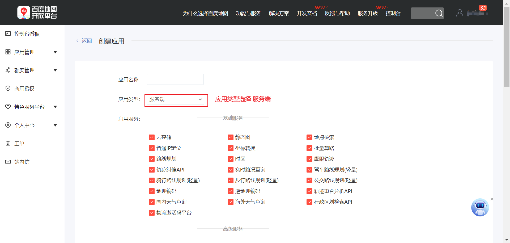

## 1. 环境准备

注册账号：
https://passport.baidu.com/v2/?reg&tt=1671699340600&overseas=&gid=CF954C2-A3D2-417F-9FE6-B0F249ED7E33&tpl=pp&u=https%3A%2F%2Flbsyun.baidu.com%2Findex.php%3Ftitle%3D%E9%A6%96%E9%A1%B5

登录百度地图开放平台：
https://lbsyun.baidu.com/

进入控制台，创建应用，获取AK：

相关接口:

https://lbsyun.baidu.com/index.php?title=webapi/guide/webservice-geocoding

https://lbsyun.baidu.com/index.php?title=webapi/directionlite-v1

## 2. 代码开发

### 2.1 application.yml

配置外卖商家店铺地址和百度地图的AK：

### 2.2 OrderServiceImpl

改造OrderServiceImpl，注入上面的配置项：

~~~java
    @Value("${sky.shop.address}")
    private String shopAddress;

    @Value("${sky.baidu.ak}")
    private String ak;
~~~

在OrderServiceImpl中提供校验方法：

~~~java
/**
     * 检查客户的收货地址是否超出配送范围
     * @param address
     */
    private void checkOutOfRange(String address) {
        Map map = new HashMap();
        map.put("address",shopAddress);
        map.put("output","json");
        map.put("ak",ak);

        //获取店铺的经纬度坐标
        String shopCoordinate = HttpClientUtil.doGet("https://api.map.baidu.com/geocoding/v3", map);

        JSONObject jsonObject = JSON.parseObject(shopCoordinate);
        if(!jsonObject.getString("status").equals("0")){
            throw new OrderBusinessException("店铺地址解析失败");
        }

        //数据解析
        JSONObject location = jsonObject.getJSONObject("result").getJSONObject("location");
        String lat = location.getString("lat");
        String lng = location.getString("lng");
        //店铺经纬度坐标
        String shopLngLat = lat + "," + lng;

        map.put("address",address);
        //获取用户收货地址的经纬度坐标
        String userCoordinate = HttpClientUtil.doGet("https://api.map.baidu.com/geocoding/v3", map);

        jsonObject = JSON.parseObject(userCoordinate);
        if(!jsonObject.getString("status").equals("0")){
            throw new OrderBusinessException("收货地址解析失败");
        }

        //数据解析
        location = jsonObject.getJSONObject("result").getJSONObject("location");
        lat = location.getString("lat");
        lng = location.getString("lng");
        //用户收货地址经纬度坐标
        String userLngLat = lat + "," + lng;

        map.put("origin",shopLngLat);
        map.put("destination",userLngLat);
        map.put("steps_info","0");

        //路线规划
        String json = HttpClientUtil.doGet("https://api.map.baidu.com/directionlite/v1/driving", map);

        jsonObject = JSON.parseObject(json);
        if(!jsonObject.getString("status").equals("0")){
            throw new OrderBusinessException("配送路线规划失败");
        }

        //数据解析
        JSONObject result = jsonObject.getJSONObject("result");
        JSONArray jsonArray = (JSONArray) result.get("routes");
        Integer distance = (Integer) ((JSONObject) jsonArray.get(0)).get("distance");

        if(distance > 5000){
            //配送距离超过5000米
            throw new OrderBusinessException("超出配送范围");
        }
    }
~~~

在OrderServiceImpl的submitOrder方法中调用上面的校验方法：

